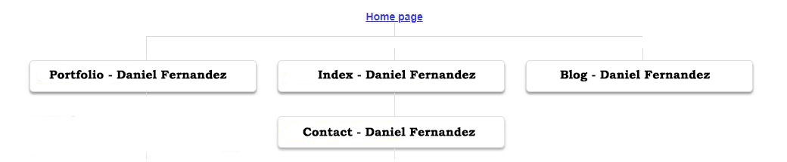
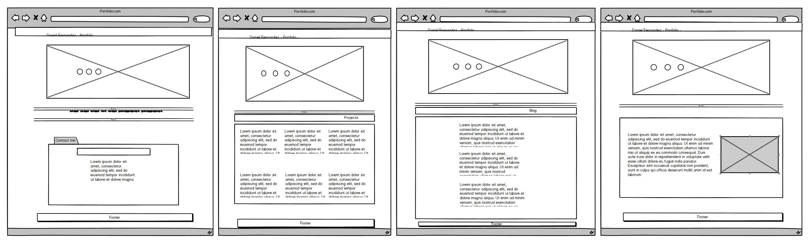
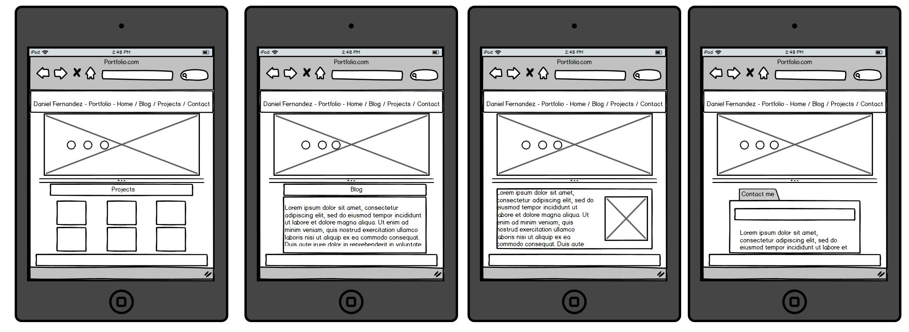
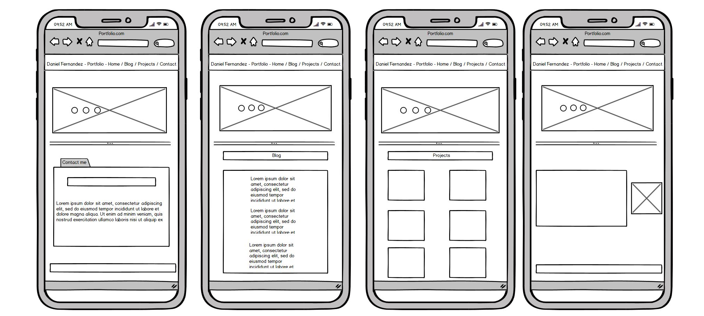
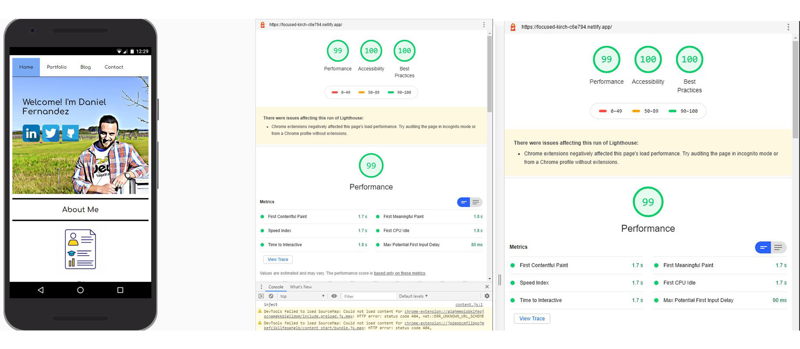

# <u>Portfolio Daniel Fernandez</u>

##### GitHub Repository: https://github.com/dannyfern/portfolio

##### Deployable Site: https://focused-kirch-c6e794.netlify.app/

### <u>Purpose</u>

To create a portfolio to showcase my ability within four weeks of learning HTML and CSS. This portfolio contains four pages including a index page, blog, portfolio and contact page with all current and future work intended. 

### <u>Functionality</u>
Functionality wise, this portfolio is completely responsive and is tested to have a 99-100% accessibility score. Functionality includes a sitewide navbar, contact sheet, CSS animations.  

### <u>Sitemap</u> 

### <u>Wireframes</u>

<u>Desktop</u> <u>Tablets</u> <u>Phones</u>

### <u>Performance</u>

### <u>Target Audience</u>
The target audience is future employee's who would like to view my work, or anyone thats interested in what I have achieved. 

### <u>Tech Stack</u>
 1. HTML
 2. CSS
 3. Netlify
 4. Github
 5. BeFunky Images
 6. Typora
